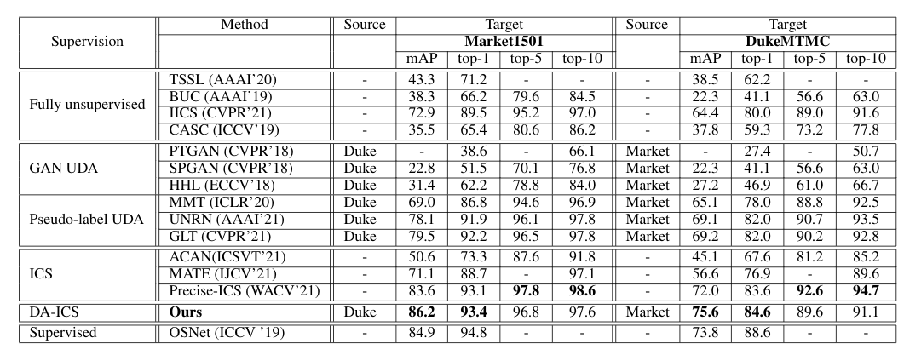

# A Simple and Effective Intra-camera Supervised Person-reID
(A part of the codes is borrowed from https://github.com/Wanggcong/Spatial-Temporal-Re-identification.git and https://github.com/layumi/Person-reID-triplet-loss)
<p align="center">
  
</p>


Our approach consists of three main steps:</br>
1- Pseudo-labeling</br>
2- Confidence estimation</br>
3- Feature representation learning</br>

</br>
#Setup and Dependencies
Install dependencies: pip install -r requirements.txt
# Pseudo-labeling
## Prepare datasets
Make a new folder 'original_dataset' in './dataset' folder and put downloaded datasets there like: 

```
./dataset
└── original_dataset
    ├── Duke
    │   ├── bounding_box_test
    │   ├── bounding_box_train
    │   └── query
    └── Market
        ├── bounding_box_test
        ├── bounding_box_train
        ├── gt_bbox
        ├── gt_query
        └── query


```
To prepare the dataset run:<br>
*python3 prepare_dataset.py --dataset_name market*

### Prepare pre-trained model
we use PCB model for training and save the trained models in ./model folder <br>

*python3 train.py --PCB --gpu_ids 0 --model_name ft_ResNet50 --erasing_p 0.5 --train_all --train_dir "./dataset/modified_dataset/" --source market*
<br>
train with Resnet50 <br>

*python3 train.py  --gpu_ids 0 --model_name ft_ResNet50 --erasing_p 0.5 --train_all --train_dir "./dataset/modified_dataset/" --source market*


## Extract visual features using pre-trained model

query_type is "query" or "multi-query" depends on the data (tracklet or single query)

*python3 extract_features.py --PCB --gpu_ids 0  --source market --target duke --query_type query*

it saves two files in ./rep folder one contains features of all single imgs, the other takes average of feature vector and frame numbers for each tracklet and save that with suffix _s 


### Extract cosine similarity score for all samples and save
for two types query and multi_query it extracts cosine features
--S for tracklets is saved as mean value

python3 extract_cosine_scores.py --PCB --gpu_ids 0 --source market --target market --query_type query  --S

### Main
Run the code to compute and save the joint features query/candidate subsets, bipartite matching and capply confidence estimation.<br>

*python3 main.py --PCB --gpu_ids 0 --source duke --target market --query_type query*


### Update the Dataset

*python3 update_dataset.py --PCB  --source market --target duke --query_type query*

### Train Multi-Task Network
For Duke<br>

*python3 train_duke.py  --gpu_ids 0 --model_name ft_ResNet50 --erasing_p 0.5  --train_dir "./dataset/modified_dataset" --source duke*

For Market<br>

*python3 train_market.py  --gpu_ids 0 --model_name ft_ResNet50 --erasing_p 0.5  --train_dir "./dataset/modified_dataset" --source market*


### Compute Mean Network
For Duke <br>
*python3 temporal_ensembeling_duke.py*

For Market <br>
*python3 temporal_ensembeling_market.py*


### Extract features 

For Duke <br>
*python3 extract_features_duke.py*

For Market <br>
*python3 extract_features_market.py*

### Evaluate
*python3 evaluate.py  --gpu_ids 0 --source duke --target duke --query_type query*


## Results
<p align="center">
  
</p>


